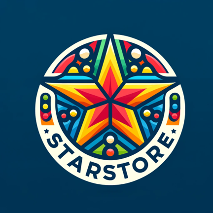

<h1 align="center">پروژه مبانی برنامه سازی پایتون</h1>
<h2 align="center">بهار 1403</h2>
<h3 align="center">StarStore</h3>

  فروشگاه StarStore به تازگی آغاز به کار کرده است. در این پروژه، قصد داریم با
  استفاده از مفاهیم شی‌گرایی و پایگاه داده، یک رابط کاربری خط فرمان (CLI) طراحی
  کنیم که امکاناتی چون ورود کاربران، ثبت نام، مدیریت سفارشات، و نظارت بر محصولات
  را برای این فروشگاه فراهم آورد.

  
  

 

<h3 align="right">صفحه اصلی</h3>

  در ورودی این سیستم، ابتدا باید تعیین شود که کاربر ورود کننده ادمین است یا
  مشتری

 
<h3 align="right">ورود ادمین</h3>

<ul align="right" style="direction: rtl">
  <li align="right">ادمین باید نام کاربری و رمز عبور خود را وارد نماید.</li>
  <li align="right">
    سیستم صحت نام کاربری و رمز عبور را بررسی کرده و در صورت احراز هویت، ادمین به
    پنل مدیریتی دسترسی پیدا می‌کند.
  </li>
</ul>

 
<h3 align="right">ورود مشتری</h3>

•مشتری دو گزینه پیش رو دارد: ثبت نام یا ورود به حساب کاربری

<ul align="right" style="direction: rtl">
  <li align="right">
    ورود به حساب کاربری: مشتری باید نام کاربری و رمز عبور خود را وارد کند. سیستم
    صحت اطلاعات را بررسی کرده و در صورت تأیید، به حساب کاربری وارد می‌شود.
  </li>
  <li align="right">
    ثبت نام
    <ul align="right">
      <li align="right">مشتری باید اطلاعات لازم را وارد نماید</li>
      <li align="right">
        یک نام کاربری انتخاب کند که پیش از این در سیستم ثبت نشده باشد.
      </li>
      <li align="right">
        سپس باید رمز عبوری انتخاب کند که شامل حداقل 8 کاراکتر، یک کاراکتر بزرگ،
        و ترکیبی از اعداد و حروف باشد.
      </li>
    </ul>
  </li>
</ul>

  این مراحل اولیه اطمینان می‌دهند که تمامی کاربران به طور مناسبی شناسایی و
  مدیریت شوند و به بخش‌های مربوط به نقش خود در سیستم دسترسی پیدا کنند.

<h3 align="right">پس از ورود به پنل مشتری</h3>
<h4 align="right">نمایش اعتبار کیف پول</h4>

  به محض ورود مشتری به پنل خود، مقدار اعتبار کیف پول او نمایش داده می‌شود.

<h4 align="right">منوی مشتری شامل</h4>

<ol align="right" style="direction: rtl">
  <li align="right">
    ثبت سفارش جدید
    <ul align="right" style="direction: rtl">
      <li align="right">
        o نمایش لیست کالاها به همراه قیمت‌ها.(هر کالا شامل یک کد منحصر به فرد
        است می تواند برای انتخاب کالا ها توسط مشتری از کد آن ها استفاده نمایید.)
      </li>
      <li align="right">
        مشتری می‌تواند کالاهای مورد نظر خود را به همراه تعداد مشخص کند.
      </li>
      <li align="right">
        اگر تعداد درخواستی بیشتر از موجودی باشد، به مشتری اطلاع داده می‌شود که
        تنها تعداد محدودی از کالا موجود است.(موجودی در انبار را به او نشان داده
        تا مجدد تعداد مورد نظر را وارد کند)
      </li>
      <li align="right">
        پس از تأیید تعداد و کالا، مجموع بهای خرید به مشتری نشان داده می‌شود.
      </li>
      <li align="right">
        از مشتری پرسیده می‌شود که آیا مایل به استفاده از اعتبار کیف پول خود برای
        پرداخت است یا خیر. در صورت تأیید، مبلغ اعتبار از کل خرید کسر می‌گردد.
      </li>
      <li align="right">
        مشتری می تواند در صورت داشتن کد تخفیف ان را وارد کرده و از ان استفاده
        کند. هر کد شامل یک درصد تخفیف و تاریخ انقضاست که پس از گذشت از این تاریخ
        امکان استفاده از ان میسر نیست
      </li>
      <li align="right">
        این کد ها به صورت یک فایل جیسون در اختیار شما قرار داده شده است.
      </li>
      <li align="right">
        پس از هر خرید 5 درصد مبلغ خریداری شده به عنوان اعتبار به کیف پول اون
        اضافه خواهد شد.
      </li>
    </ul>
  </li>
  <li align="right" style = "list-style-type:none;">
    تاریخچه سفارشات:نمایش تمام سفارشات گذشته مشتری به همراه مبلغ پرداخت شده و
    تاریخ
  </li>
  <li align="right">
    تغییر رمز عبور:امکان تغییر رمز عبور برای تأمین امنیت بیشتر حساب کاربری.رمز
    عبور جدید باید شامل حداقل 8 کاراکتر باشد و ترکیبی از اعداد و حروف را دارا
    باشد و حداقل شامل یک کاراکتر بزرگ باشد
  </li>
</ol>

 
<h4 align="right">پنل ادمین</h4>

  پنل ادمین شامل گزینه‌های زیر است تا به مدیریت دقیق و اثربخش فروشگاه کمک کند:

<ol align="right" style="direction: rtl">
  <li>
    اضافه کردن کالا جدید
    <ul>
      <li>
        دمین با وارد کردن کد منحصر به فرد برای کالای جدید، در صورت نبود آن در
        سیستم، می‌تواند آن را به فروشگاه اضافه کند.
      </li>
      <li>همچنین اطلاعات مربوط به قیمت و موجودی اولیه کالا را تعیین می‌کند.</li>
    </ul>
  </li>
  <li>
    تغییر موجودی یک کالا:با وارد کردن کد کالا، ادمین می‌تواند موجودی آن را با
    افزایش یا کاهش به روز رسانی کند.
  </li>
  <li>
    تغییر قیمت یک کالا:ادمین با دسترسی به کد کالا، قادر است قیمت آن را تنظیم
    کند، چه با افزایش و چه با کاهش
  </li>
  <li>
    تغییر رمز عبور:این قابلیت به ادمین اجازه می‌دهد تا جهت تامین امنیت بیشتر
    حساب کاربری خود، رمز عبورش را تغییر دهد.رمز عبور جدید باید شامل حداقل 8
    کاراکتر باشد و ترکیبی از اعداد و حروف را دارا باشد و حداقل شامل یک کاراکتر
    بزرگ باشد.
  </li>
</ol>

<h3 align="right">کلاس های اصلی</h3>
<h4 align="right">
  کلاس User: پایه‌ای برای ارث‌بری توسط کلاس‌های Admin و Customer.
</h4>
<ul style="direction: rtl">
  <li>ادمین</li>
  <li>مشتری</li>
  <li>کالا</li>
</ul>

  برای مدیریت داده‌های مرتبط با کالاها، مشتریان، و مدیران سیستم، استفاده از
  پایگاه داده‌.الزامی است .علاوه بر این، تعریف و پیاده‌سازی کلاس‌های اصلی که در
  مستندات پروژه ذکر شده‌اند،اجباری بوده و در فرآیند ارزیابی پروژه، این کلاس‌ها
  مورد بررسی قرار خواهند گرفت. همچنین، افزودن کلاس‌های اضافی به منظور توسعه و
  بهبود عملکرد سیستم بلامانع است. همچنین قابلیت برگشت به عقب نیز وجو داشته باشد

<h3 align="right">cli دستورات ورودی در  :</h3>

  برای استفاده از دستورات ورود به سیستم می توانید از شرط ها برای parse کردن
  استفاده کنید یا می توانید برای سادگی و راحتی کار از کتاب خانه argparser
  استفاده کنید.اما به این نکته توجه داشته باشید که عدم استفاده از کتاب خانه باعث
  یادگیری بهتر شما خواهد شد.

<h3 align="right">نمایش جداول:</h3>

  براش نمایش جداول موجود در پروژه مانند لیست محصولات و ... برای زیبایی بهتر از
  کتاب خانه tabulate استفاده کنید.

<h3 align="right">جداول مورد نیاز پایگاه داده:</h3>
<ol align="right" style="direction: rtl">
  <li align="right">
    جدول users برای مدیریت کاربران : این جدول علاوه بر ستون های username و
    password باید حتما دارای یک ستون به نام access باشد که تفاوت بین مشتری و
    ادمین را مشخص نماید. عدد 1 به معنای سطح دسترسی ادمین و عدد 2 به معنای سطح
    دسترسی مشتری می باشد.
  </li>
  <li align="right">
    جدول Extrainfos : هر کاربر با سطح دسترسی 2 که همان مشتری می باشد با این جدول
    یک رابطه ی 1-1 دارد که اطلاعات اضافه تر خود در این جدول ذخیره می شود.(منظور
    از اطلاعات اضافه اطلاعاتی می باشد که با کاربر با سطح دسترسی 1 که همان ادمین
    می باشد، متفاوت باشد. به طور مثال ستون اعتبار کیف پول در این بخش قرار می
    گیرد.)
  </li>
  <li>جدول کالاها:اطلاعات مربوط به کالا ها در این جدول قرار خواهد گرفت.</li>
  <li>
    جدول کد های تخفیف : با استفاده از نمونه فایل جیسون چیدمان مربوط به این جدول
    انجام داده خواهد شد. این جدول باید دارای یک ستون used باشد که دارای دو مقدار
    0 و 1 است. عدد 0 به معنای کد تخفیف استفاده شده و عدد 1 به معنای کد تخفیف
    استفاده نشده می باشد.
  </li>
  <li>
    جدول تاریخچه سفارشات : در این جدول به ازای هر سفارش موفق یک کاربر با سطح
    دسترسی 2 که همان مشتری می باشد ، یک رکورد اضافه خواهد شد. بدیهی است که جدول
    کاربران با این جدول رابطه 1-چند دارد. به این معنی که هر کاربر می تواند چندین
    سفارش ثبت کرده باشد.
  </li>
</ol>

 

  Created by
  <a href=#>Project Team</a>

